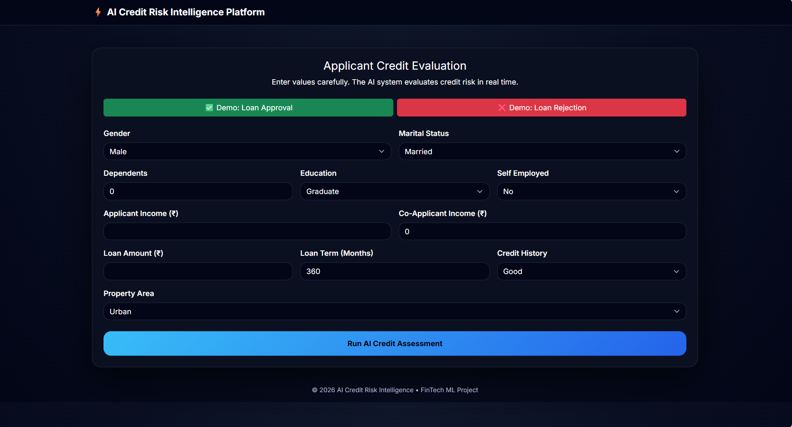
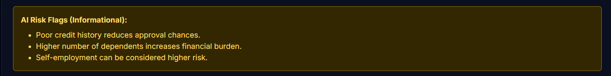

## 💳 AI Credit Risk Intelligence Platform (Loan Approval System)

[](#)


---

## 📸 Screenshots

### Home / Input Form


### Loan Approval Result


### Loan Rejection Result


### Explainable AI Insights


### PDF Loan Assessment Report


---

## 🧠 Overview

**AI Credit Risk Intelligence Platform** is a **full-stack machine learning web application** that predicts **loan approval status** using applicant financial and demographic data.

The system goes beyond simple prediction by providing:

• Approval probability  
• Risk classification (Low / Medium / High)  
• Explainable AI decision insights  
• Downloadable **PDF loan assessment reports**  
• Demo scenarios for instant testing  

This project closely mirrors **real-world banking credit assessment systems**.

---

## 🎯 Project Objective

To build a **production-ready, explainable loan approval system** that combines:

• Machine Learning classification  
• Business-oriented risk interpretation  
• Transparent AI explanations  
• Professional reporting (PDF)  
• Clean UI/UX for demos and interviews  

---

## 🚀 Key Features

### 🤖 Machine Learning

✅ Support Vector Machine (SVM – Linear Kernel)  
✅ Feature scaling using `StandardScaler`  
✅ Hyperparameter tuning using `GridSearchCV`  
✅ Class imbalance handling (`class_weight='balanced'`)  
✅ Probability estimation using decision function + sigmoid  

---

### 📊 Prediction Outputs

✅ Loan Approved / Rejected decision  
✅ Approval Probability (%)  
✅ Risk Level:

• LOW RISK 🟢  
• MEDIUM RISK 🟠  
• HIGH RISK 🔴  

---

### 🧠 Explainable AI (XAI)

Since SVM is not inherently interpretable, **rule-based Explainable AI** is implemented to provide **transparent, human-readable reasons**, such as:

• Poor credit history  
• High loan-to-income ratio  
• High number of dependents  
• Self-employment risk  
• Strong financial profile (positive insight)  

This approach aligns with **banking and regulatory expectations**.

---

### 📄 PDF Loan Assessment Report

📥 One-click **Download PDF** feature  
📑 Report includes:

• Loan decision  
• Approval probability  
• Risk level  
• Explainable AI insights  
• Timestamp  

📌 Designed to resemble **real banking credit reports**

---

### 🎭 Demo Mode (For Interviews & Presentations)

✅ Demo: Loan Approval  
✅ Demo: Loan Rejection  

• Instantly fills realistic sample data  
• User manually submits the form  
• Perfect for **viva, demos, and recruiters**

---

### 🎨 UI / UX

✨ Clean fintech-style UI  
✨ Bootstrap 5 responsive design  
✨ Dark theme dashboard  
✨ Clear result cards  
✨ Professional layout  
✨ Portfolio-ready appearance  

---

## 🤖 Machine Learning Model Used

### Support Vector Machine (SVM)

• Kernel: Linear  
• Tuned using GridSearchCV  
• Best parameter: `C = 0.01`  
• Optimized using **F1-Score** (handles class imbalance)  

📌 Probability calculated using:

decision_function → sigmoid


---

## 🧠 Model Evaluation Highlights

• Very high recall for eligible applicants  
• Extremely low false-negative rate  
• Business-friendly risk trade-off  
• Strong generalization on unseen data  

---

## 📂 Dataset Information

The model is trained on a **loan approval dataset** containing:

• Gender  
• Marital status  
• Dependents  
• Education  
• Employment type  
• Applicant & Co-applicant income  
• Loan amount & term  
• Credit history  
• Property area  

📌 Categorical features encoded  
📌 Numerical features scaled  

---

## 📦 Installation

### 1️⃣ Create Virtual Environment (Conda)

```bash
conda create -n ml-py310 python=3.11
conda activate ml-py310
```
### 2️⃣ Install Dependencies

```bash
pip install -r requirements.txt
```
### Run the Flask App

```bash
python app.py
```
 ### ✅ What You Can Do

• Enter applicant details manually
• Use demo buttons for instant testing
• Get loan approval decision
• View approval probability & risk level
• Understand AI decision reasoning
• Download PDF loan assessment report

### 🧪 Educational Disclaimer

⚠️ This project is developed for learning, demonstration, and portfolio purposes only.
It should not be used directly for real financial or lending decisions without proper validation, compliance checks, and regulatory approval.

### 📫 Contact

📧 Email: kadithyaom@gmail.com

🔗 GitHub: https://github.com/adithyaom18/AI-Credit-Risk-Intelligence-Platform.git

🔗 LinkedIn: https://www.linkedin.com/in/k-adithya-om

### 🌐 Live Demo
